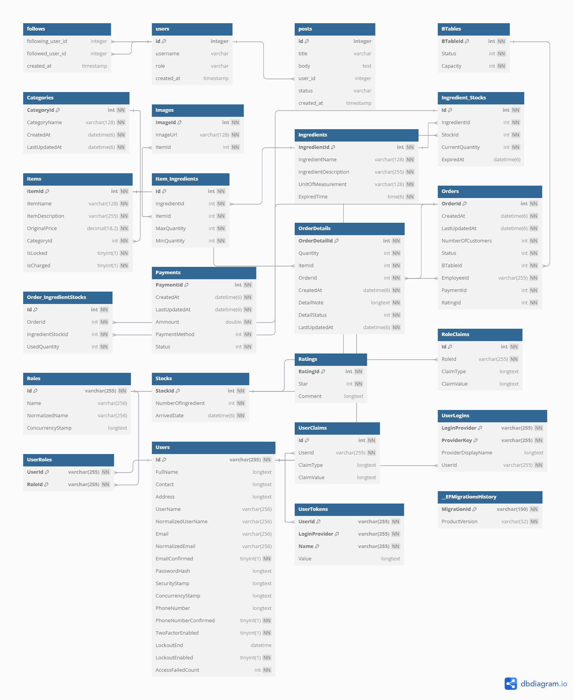

# Buffet Microservice

This is an extension from midterm buffet Microservice backend APIs 
Building an microservices for Ingredient & Stock management for a buffet branch with feature as 
- Associate Food Items to Ingredients
- Managing Ingredients amount based on the amount of food item ordered
- Update the Ingredient amount based on stock at the end of day by the staff to ensure practical amount compared to the calculated amount by the business logic
- Notify that ingredients which are close to it expire date, implemented Pub/Sub Notification
- Update ingredient on stock and amount when a new batch arrive
- Documented using Swagger

 


```cmd
dotnet ef migrations add AddOrderModel --startup-project .\AuthenticationServices\ --project .\Shared\

dotnet ef database update --project .\AuthenticationServices\
```
